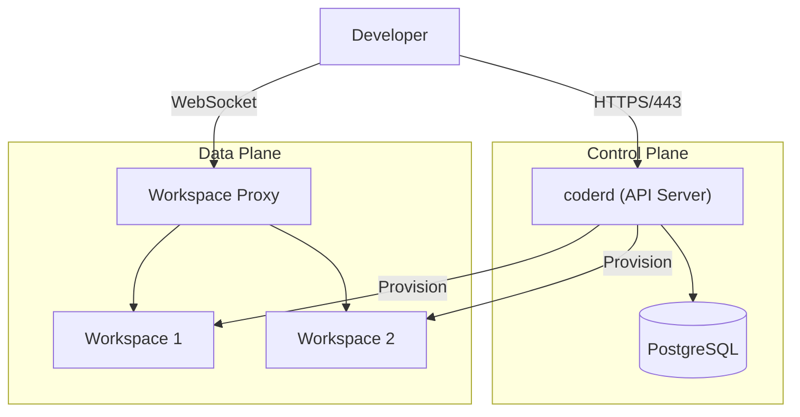

# Coder Diagrams

Generate infrastructure, network, and architecture diagrams for [Coder](https://coder.com) deployments.

## When to Use

Activate this skill when asked to produce diagrams related to Coder infrastructure, deployment architecture, or network topology.

## Before Starting

Always clarify:
1. **Audience**: Pre-sales, onboarding, or engineering?
2. **Environment**: Kubernetes, Docker, VM, or air-gapped?
3. **Scope**: Full deployment, single component, or network flow?

## Diagram Types

### Deployment Architecture
Show how Coder components are deployed:
- **coderd** (control plane)
- **Workspace proxies** (regional relays)
- **Provisioners** (Terraform-based workspace creation)
- **Database** (PostgreSQL)
- **Workspaces** (developer environments)

### Network Topology
Show network flows between:
- Developer browser → Coder dashboard
- Coder → workspace (via WebSocket/SSH)
- Workspace proxy relay paths
- Provisioner → infrastructure provider (AWS, GCP, Azure, K8s)

### Component Diagrams
Detail internal component relationships:
- API server, provisioner daemon, workspace agents
- Authentication flow (OIDC, built-in)
- Template system and workspace lifecycle

## Output Format

- **Iteration**: Produce Mermaid inline in chat for quick iteration
- **Finalized**: Export `.mmd` files for polished diagrams
- Use clear labels, consistent color schemes, and logical grouping

## Style Conventions

- Use `subgraph` for logical grouping (e.g., "Control Plane", "Data Plane")
- Color code by concern: blue for control plane, green for data plane, orange for external
- Include port numbers and protocols where relevant (HTTPS/443, SSH/22, WebSocket)
- Add notes for non-obvious connections (e.g., "DERP relay for NAT traversal")

## Example

